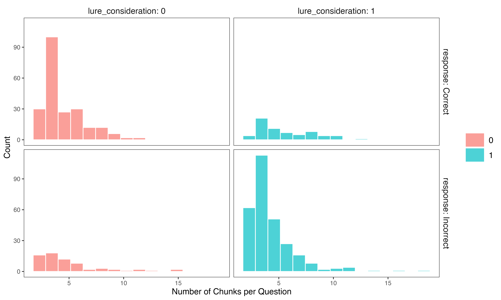

# Rythm of Thoughts: Exploring the Dynamics of Deliberation in Reasoning

This document describes the analysis of deliberation function trajectories extracted from verbal reasoning data. Using LLM-based scoring of reasoning segments (chunks), we model how different cognitive functions unfold over time within transcriptions.

---

## Introduction and Motivation

Understanding how people deliberate when solving reasoning problems is a key question in cognitive psychology. Recent theoretical work by [De Neys (2025)](https://files.osf.io/v1/resources/f7436_v1/providers/osfstorage/67a6196095008bb4100c5869?action=download&direct&version=1) has highlighted critical gaps in our knowledge of the dynamics of deliberation.

Most traditional models treat deliberation as a monolithic process, typically focusing only on response control — the inhibition of an intuitive but incorrect answer. However, De Neys proposes that deliberation involves multiple distinct cognitive functions:

- *Response Control*: Inhibiting or resisting an intuitive or prepotent response.
- *Response Generation*: Actively searching for new answers, alternatives, or hypotheses.
- *Response Justification*: Providing reasons, arguments, or explanations for a response.
- *Response Regulation*: Monitoring, evaluating, or allocating effort in the reasoning process.

We use this broad theoretical taxonomy as the basis for our analyses. Crucially, De Neys raises an open question: when people engage in deliberation, do these functions follow a specific activation order or sequence? Or is their engagement driven by situational factors, such as the level of uncertainty experienced by the reasoner?

Currently, there is no direct empirical evidence to address this question. Exploring the temporal dynamics of deliberation functions could provide valuable insights into how people engage in reflective thinking. Our work aims to contribute to this effort by using language models to automatically segment and score verbal reasoning data. This approach allows us to track, at a fine-grained level, how different deliberation functions unfold over time within participants' verbalizations.

---

## Data and Audio Transcription

The data come from Study 2 of [Byrd et al. (2023)](https://www.mdpi.com/2079-3200/11/4/76), conducted online with 102 adult participants from Prolific. Participants completed a verbal version of the Cognitive Reflection Test (vCRT) by thinking aloud as they solved each problem.

Participants' verbalizations were recorded as audio files and subsequently transcribed using a state-of-the-art automatic speech recognition model: `Whisper Large v3 Turbo`.

---

## Chunking and Scoring of Transcriptions

We used the `meta-llama/Llama-3.3-70B-Instruct` model served via the HuggingFace Inference API.

The generation parameters were set to:

- `temperature = 1`
- `top_p = 1`

These settings encouraged the model to generate coherent but flexible segmentations of participants' transcriptions into distinct ideas or reasoning steps.

### Chunking Procedure

The model was prompted to segment each transcription into coherent units corresponding to distinct ideas, reasoning steps, or meta-comments.

The chunking prompt was the following:

```text
You are an expert in cognitive psychology and verbal protocol analysis.

You are given a transcription of a participant thinking aloud while solving a problem.

Your task is to segment this transcription into meaningful chunks.

A chunk should correspond to a coherent idea, thought, or step in the participant's reasoning or verbal expression — including hesitations, repetitions, or meta-comments. The goal is not only to segment explicit reasoning steps but to preserve the full structure of the verbalization.

Guidelines:
- Do not remove or suppress any part of the original text.
- Do not segment based on arbitrary word count or length.
- Split only when the participant clearly moves to another distinct thought, idea, or reasoning step (e.g., shifting from generating an answer to justifying it, or reflecting on their uncertainty).
- Be conservative in splitting: avoid unnecessary fragmentation.
- Preserve the original wording exactly in each chunk.

Provide your output strictly in the following structure:

Chunk 1:
[exact text of chunk 1]

Chunk 2:
[exact text of chunk 2]

Chunk 3:
[exact text of chunk 3]

Be exhaustive.
```

### Scoring Procedure

Each chunk was then automatically scored by the LLM for the intensity of four deliberation functions:

- Response Control
- Response Generation
- Response Justification
- Response Regulation

Scores range from 0 (not at all present) to 100 (very strongly present). The scoring prompt was the following:

```text
You are an expert in cognitive psychology.

You are given a short chunk of a participant's think-aloud transcription during a reasoning task.

Your task is to rate how strongly this chunk expresses each of the following deliberation functions.

Definitions of the deliberation functions:

- Response Control: Inhibiting, rejecting, or resisting an obvious or intuitive response that first comes to mind. Typical signs include expressions of doubt, suppression of initial answers, hesitation, or stopping oneself from blurting out an impulsive response.

- Response Generation: Actively searching for new possible answers, alternatives, or hypotheses. This includes exploring options, mentally simulating scenarios, considering possibilities, or applying step-by-step logical reasoning.

- Response Justification: Providing explicit reasons, arguments, or explanations to support a response that is currently being considered (whether intuitive or not). This includes defending a choice, explaining why an answer makes sense, or making an argument.

- Response Regulation: Reflecting on one's own reasoning process, monitoring one's performance, allocating effort, expressing uncertainty, or deciding whether to continue thinking or stop. This includes metacognitive monitoring or strategic regulation of effort.

Important Instructions:

- Each score should reflect the extent to which the chunk expresses the function (even partially), using a continuous scale from 0 (not at all present) to 100 (very strongly present).
- These functions are not mutually exclusive — a chunk may score highly on multiple functions if they co-occur.
- If the chunk contains no trace of any of these 4 functions, assign 0 to all functions. This is perfectly acceptable.
- If the chunk expresses a completely different kind of function (not captured by the 4 above), mention it below using a very broad and generic label (e.g., "Reading Aloud", "Task Repetition", "Social Comment", etc.). This should only happen rarely and only if clearly justified by the content of the chunk.
- Be conservative: If you are unsure whether a function is expressed, prefer giving a low score (0-10).
- Do not explain or justify the scores unless the chunk clearly expresses a different kind of function.

Output strictly in this structure (and nothing else):

Response Control: [score between 0 and 100]
Response Generation: [score between 0 and 100]
Response Justification: [score between 0 and 100]
Response Regulation: [score between 0 and 100]

[Optional broad label for a different function — only if clearly needed]
```

## Validation of LLM Function Scores

We examined the relationships between the four deliberation functions scored by the LLM: Control, Generation, Justification, and Regulation. This analysis allows us to check whether the functions capture distinct aspects of the reasoning process, as theoretically expected.

We computed a single correlation matrix including both the LLM function scores and hand-coded indicators of reflective thinking from Byrd et al. (2023). These hand-coded variables correspond to two key components of reflection:

- Deliberateness: Whether the participant verbally reconsidered their initial response (named *reconsidered _initial_resp* in the Figure). 
- Consciousness: Whether the participant verbalized reasons for or against a response (named *verbalized_reasons* in the Figure).

These ratings were assigned based on the procedure described by Byrd et al., with moderate inter-rater agreement.


*Figure 1. Correlation heatmap between LLM function scores and hand-coded variables from Byrd et al. (2023). This joint analysis allows us to verify whether LLM-derived functions capture distinct constructs while aligning with established indicators of reflection. Only significant correlations (p < .05) are shown.*

---

## Distribution of Number of Chunks

We examined the distribution of the number of reasoning segments (chunks) per question.

### Overall Distribution


*Figure 2. Histogram showing the distribution of the number of reasoning chunks per question.*

### By Accuracy


*Figure 3. Histogram of the number of chunks per question by response type.*

### By Lure Consideration

Lure consideration corresponds to whether participants reported having thought of the intuitive but incorrect lure response during their reasoning process. Following each question, participants were explicitly asked whether the lure answer occurred to them (e.g., "Have you thought at any point that '1st place' could be the answer?").


*Figure 4. Histogram of the number of chunks per question by lure consideration.*

### By Accuracy and Lure Consideration



*Figure 5. Histogram of the number of chunks per question by accuracy and lure consideration.*

---

## Trajectories of Deliberation Functions Over Time

We model the dynamics of each deliberation function over normalized time within transcriptions.

Normalized time corresponds to the relative position of each reasoning chunk within a given transcription. This measure captures the sequential unfolding of thoughts, independent of the actual duration or word length of each chunk.

Technically, the normalized position of a chunk is computed as:

```normalized_position = (chunk_id - 1) / (n_chunks - 1)```

where chunk_id is the sequential number of the chunk within the transcription, and n_chunks is the total number of chunks for that participant and question.

This transformation ensures that the first chunk always has a normalized position of 0, the last chunk a position of 1, and intermediate chunks are evenly distributed between them. Importantly, this is not a measure of real time or duration — it reflects the ordinal progression of reasoning steps.

Thus, normalized time provides a positional representation of thought dynamics, allowing us to compare the trajectory of deliberation functions across responses of varying length and verbosity.

### Overall Trajectory


*Figure 7. Mean trajectory of each deliberation function across all responses.*

### Trajectory by Accuracy


*Figure 8. Mean trajectory of deliberation functions by accuracy.*\

---

## Difference in Trajectories Between Response Types

We computed the difference in function trajectories between incorrect and correct responses.

### Overall Difference


*Figure 9. Difference in trajectories (correct minus incorrect) across deliberation functions.*

---

## GAM-Predicted Trajectories

We fitted generalized additive models (GAMs) to predict function trajectories.


*Figure 10. GAM-predicted trajectories for each deliberation function. Shaded areas represent 95% confidence intervals.*

---

## Pairwise Differences Between Functions (GAM)

We computed pairwise differences between function trajectories based on GAM predictions.


*Figure 11. Pairwise differences between deliberation function trajectories. Shaded grey areas indicate significant differences (p < .05, FDR corrected).*\

---

## Trajectories by Accuracy and Function (GAM)


*Figure 12. GAM-predicted trajectories by accuracy and deliberation function. Shaded grey areas indicate significant differences (p < .05, FDR corrected).*\

---

## Trajectories by Lure Consideration (GAM)


*Figure 13. GAM-predicted trajectories by lure consideration and accuracy. Shaded grey areas indicate significant differences (p < .05, FDR corrected).*\

---

## Trajectories by Familiarity (GAM)


*Figure 14. GAM-predicted trajectories by participant familiarity with the test material. Shaded grey areas indicate significant differences (p < .05, FDR corrected).*

