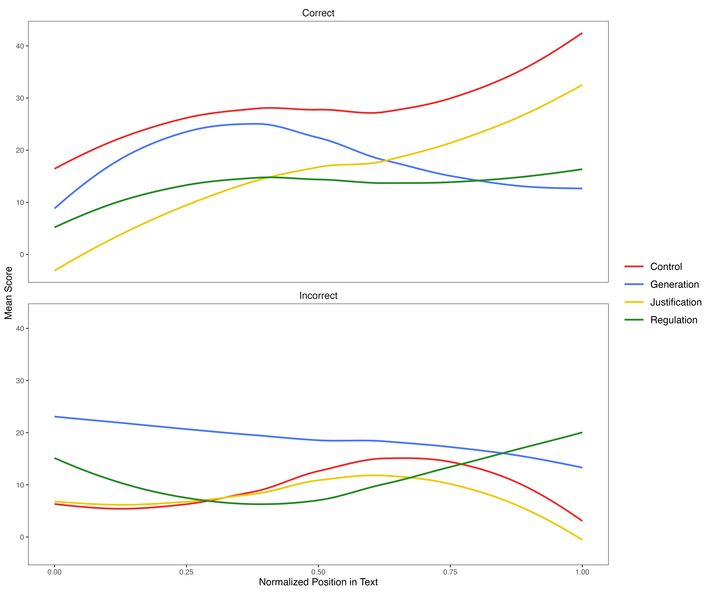
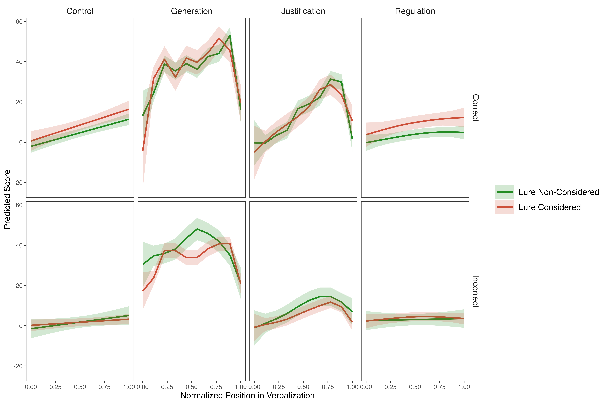
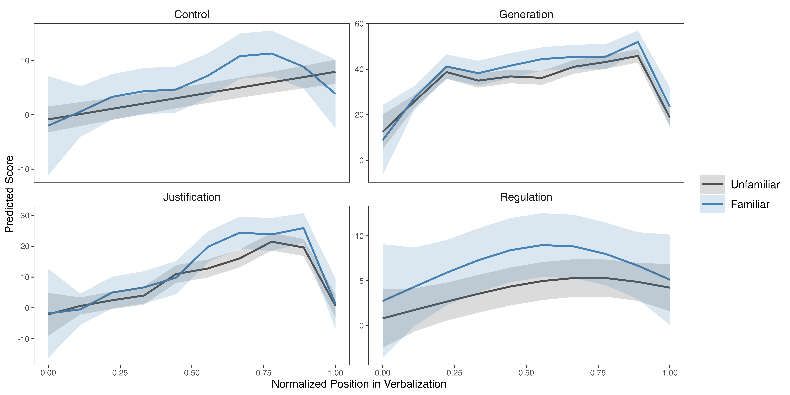

# Rythm of Thoughts: Exploring the Dynamics of Deliberation in Reasoning

This document describes the analysis of deliberation function trajectories extracted from verbal reasoning data. Using LLM-based scoring of reasoning segments (chunks), we model how different cognitive functions unfold over time within transcriptions. Analyses are based on generalized additive models (GAMs) and visualized using ggplot2.

---

## Correlation Between Deliberation Functions

We computed the correlation matrix between the four deliberation functions scored by the LLM: Control, Generation, Justification, and Regulation.

*Figure 1. Correlation heatmap between deliberation functions scored by the LLM. Only significant correlations (p < .05) are shown.*

---

## Validation with Handscored Data

We validated the LLM-derived function scores against hand-coded indicators of reflective thinking (reconsideration of initial response, verbalized reasons).

*Figure 2. Correlation heatmap between LLM function scores and hand-coded variables. Only significant correlations (p < .05) are shown.*

---

## Distribution of Number of Chunks

We examined the distribution of the number of reasoning segments (chunks) per question.

### Overall Distribution

*Figure 3. Histogram showing the distribution of the number of reasoning chunks per question.*

### By Response Type

*Figure 4. Histogram of the number of chunks per question by response type.*

### By Lure Consideration

*Figure 5. Histogram of the number of chunks per question by lure consideration.*

### By Response Type and Lure Consideration

*Figure 6. Histogram of the number of chunks per question by response type and lure consideration.*

---

## Trajectories of Deliberation Functions Over Time

We model the dynamics of each deliberation function over normalized time within transcriptions.

### Overall Trajectory

*Figure 7. Mean trajectory of each deliberation function across all responses.*

### Trajectory by Response Type

*Figure 8. Mean trajectory of deliberation functions by response type (biased vs unbiased).*\

---

## Difference in Trajectories Between Response Types

We computed the difference in function trajectories between unbiased and biased responses.

### Overall Difference

*Figure 9. Difference in trajectories (unbiased minus biased) across deliberation functions.*

---

## GAM-Predicted Trajectories

We fitted generalized additive models (GAMs) to predict function trajectories.

*Figure 10. GAM-predicted trajectories for each deliberation function. Shaded areas represent 95% confidence intervals.*

---

## Pairwise Differences Between Functions (GAM)

We computed pairwise differences between function trajectories based on GAM predictions.

*Figure 11. Pairwise differences between deliberation function trajectories. Shaded grey areas indicate significant differences (p < .05, FDR corrected).*\

---

## Trajectories by Response Type and Function (GAM)

*Figure 12. GAM-predicted trajectories by response type and deliberation function. Shaded grey areas indicate significant differences (p < .05, FDR corrected).*\

---

## Trajectories by Lure Consideration (GAM)

*Figure 13. GAM-predicted trajectories by lure consideration and response type. Shaded grey areas indicate significant differences (p < .05, FDR corrected).*\

---

## Trajectories by Familiarity (GAM)

*Figure 14. GAM-predicted trajectories by participant familiarity with the test material. Shaded grey areas indicate significant differences (p < .05, FDR corrected).*

